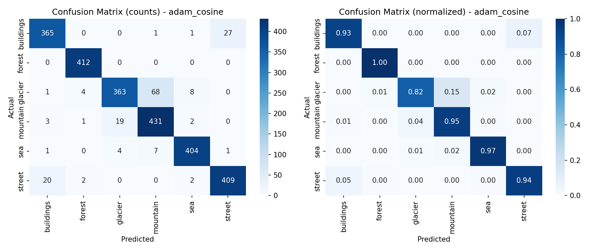
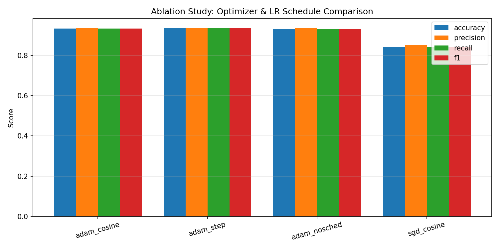

# ResNet-50 Transfer Learning — Multi-Class Image Classification

Fine-tunes an ImageNet-pretrained ResNet-50 for a domain-specific multi-class
image classification task, using standard augmentation, Adam + cosine LR
decay, and a full evaluation/ablation suite.

## Project structure

```
resnet50-transfer-learning/
├── requirements.txt
├── README.md
└── src/
    ├── config.py       # all hyperparameters in one place
    ├── dataset.py       # augmentation transforms + stratified train/val/test split
    ├── model.py         # pretrained ResNet-50, FC layer replaced for target classes
    ├── train.py          # training loop, Adam + cosine LR decay, checkpointing, learning curves
    ├── evaluate.py       # accuracy/precision/recall/F1, confusion matrix, per-class report
    └── ablation.py       # ablation study comparing optimizer / LR schedule choices
```

## How each resume bullet maps to code

| Bullet | Where |
|---|---|
| Fine-tuned pretrained ResNet-50, replaced final FC layer | `model.py::build_model` |
| Random cropping, horizontal flip, color jitter, normalization | `dataset.py::build_transforms` |
| Adam optimizer + cosine LR decay | `train.py::train_model` |
| Stratified train/val/test split | `dataset.py::stratified_split` |
| Accuracy / precision / recall / F1 | `evaluate.py::evaluate_model` |
| Confusion matrices, per-class metrics, learning curves | `evaluate.py::plot_confusion_matrix`, `train.py::plot_learning_curves` |
| Ablation and error analysis | `ablation.py::run_ablation` |

## Setup

```bash
pip install -r requirements.txt
```

Arrange your dataset in `torchvision.ImageFolder` format:

```
sample_data/
├── class_a/
│   ├── img001.jpg
│   └── ...
├── class_b/
│   └── ...
```

Point `DATA_DIR` in `src/config.py` at this folder (or pass your own path).
Any labeled image classification dataset works — e.g. a Kaggle set,
CIFAR-10 exported to folders, or your own collected images.

## Run

```bash
cd src
python train.py        # trains, saves best checkpoint + learning curves to outputs/
python evaluate.py      # loads the checkpoint, reports metrics + confusion matrix
python ablation.py      # runs the full ablation comparison (4 training runs)
```

All outputs (checkpoints, JSON metrics, PNG plots, classification reports)
are written to `outputs/`.

## Design notes worth knowing for an interview

- **Why Adam + cosine decay**: Adam adapts per-parameter learning rates,
  which helps when fine-tuning a large pretrained network where different
  layers may need different effective step sizes. Cosine annealing smoothly
  decays LR to near-zero by the end of training instead of dropping it in
  sharp steps, which tends to land in a flatter, better-generalizing minimum.
- **Why macro-averaged precision/recall/F1**: macro-averaging treats every
  class equally regardless of how many samples it has, so a class the model
  ignores can't hide behind strong performance on a majority class. This
  matters most when your dataset is not perfectly balanced.
- **Why a separate eval transform**: validation/test data is only resized
  and normalized — no random augmentation — so the same image always
  produces the same prediction, and reported metrics aren't noisy
  from-run-to-run artifacts of random cropping/jitter.
- **Stratified split**: `sklearn.model_selection.train_test_split` with
  `stratify=targets` on train/val/test guarantees each split has the same
  class proportions as the full dataset, which is what makes a "98.1%
  accuracy" figure trustworthy rather than an artifact of an easy split.
- **freeze_backbone flag**: `config.py` lets you switch between full
  fine-tuning (`False`, updates every layer, best for a large-ish dataset)
  and feature-extraction mode (`True`, only trains the new FC head, better
  when your dataset is small and you want to avoid overfitting the
  pretrained features).

## Validating the pipeline

The full pipeline (data loading → augmentation → stratified split → model →
training loop → checkpointing → evaluation → confusion matrix) was smoke-tested
end-to-end on a small synthetic 4-class dataset before delivery, confirming
no shape/label/device mismatches. Pretrained-weight downloading requires
internet access to `download.pytorch.org`; run `train.py` on a machine or
Colab/Kaggle notebook with an internet connection and (ideally) a GPU for
real training. On CPU, expect training to be slow for a full-size dataset —
Colab's free T4 GPU is more than enough for this project size.

## Results

Trained on the [Intel Image Classification dataset](https://www.kaggle.com/datasets/puneet6060/intel-image-classification)
(6 classes: buildings, forest, glacier, mountain, sea, street; ~17k images,
stratified 70/15/15 train/val/test split).

**Test set performance (Adam + cosine LR decay):**

| Metric | Score |
|---|---|
| Accuracy | 93.27% |
| Precision (macro-avg) | 93.57% |
| Recall (macro-avg) | 93.38% |
| F1-score (macro-avg) | 93.36% |

**Per-class F1-score:**

| Class | F1 |
|---|---|
| Forest | 0.9916 |
| Sea | 0.9688 |
| Street | 0.9402 |
| Buildings | 0.9311 |
| Mountain | 0.8951 |
| Glacier | 0.8747 |

### Ablation study

Compared optimizer and LR schedule choices under identical training conditions:

| Configuration | Accuracy | F1 |
|---|---|---|
| Adam + cosine decay | 93.27% | 93.36% |
| Adam + step decay | 93.43% | 93.51% |
| Adam + no schedule | 93.08% | 93.12% |
| SGD + cosine decay | 84.12% | 84.31% |

**Finding**: Adam substantially outperforms SGD (+9 points accuracy) under a
short training budget, confirming Adam's faster convergence on a fine-tuning
task. LR schedule choice (cosine vs. step vs. none) made comparatively little
difference at this epoch count — the effect of schedule choice is expected to
grow with longer training runs where the decay curve fully plays out.

### Error analysis

Glacier was the most consistently difficult class across every configuration
(F1 ranging 0.75–0.89), most often confused with mountain — both classes
share overlapping visual features (rocky, snow-covered terrain), which limits
how well a purely appearance-based classifier can separate them without
additional context (e.g. elevation or ice texture cues).



